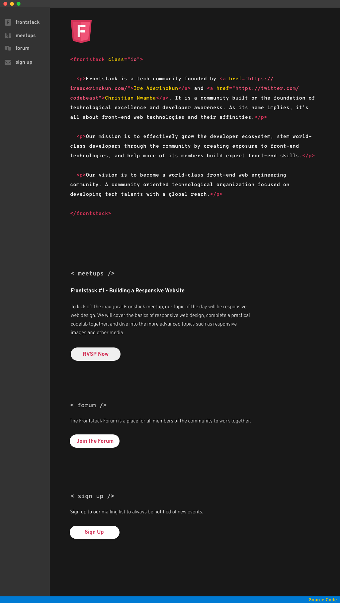
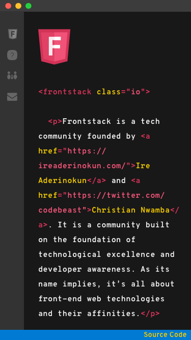

# Responsive Web Design Codelab

Speaker: [Ire Aderinokun](https://ireaderinokun.com)

In this codelab, we are going to build out the frontstack.io website into a responsive site.

## Mockups

Desktop | Mobile
--------|-------
 | 

## Getting Started

1. Make sure you have the following dependencies installed:

- [Node.js & NPM](https://nodejs.org/en/)
- [Gulp.js](https://gulpjs.com/) (Optional: If you want to use the live-reload server from this project)

2. Clone the `start` directory

3. Install package dependencies

```
npm install
```

or 

```
yarn install
```

4. Start server

```
npm start
```

## Codelab Steps

1. Review repository HTML & CSS
1. Menubar
1. Footer
1. Main Content
1. Sidebar
